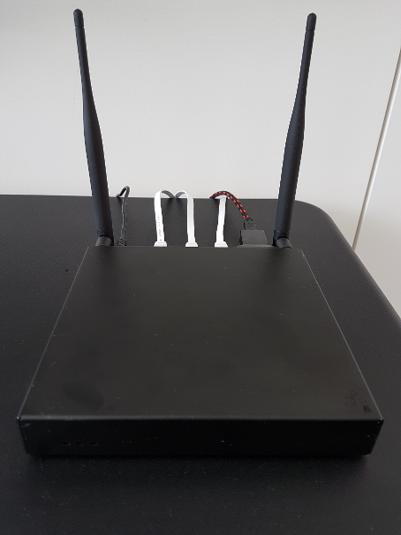
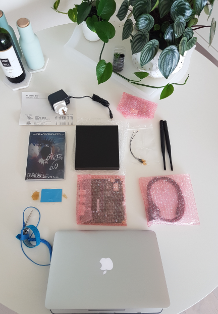
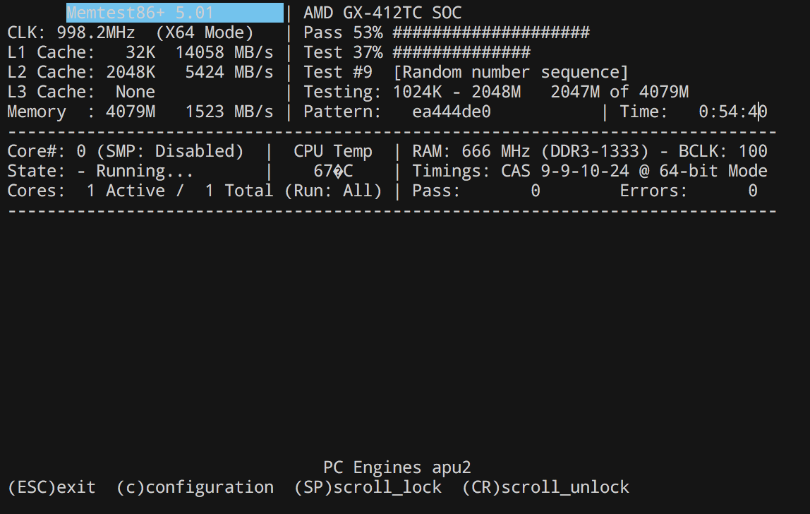
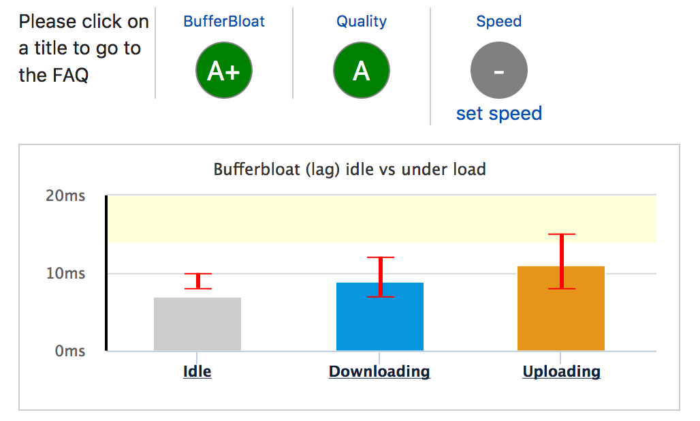
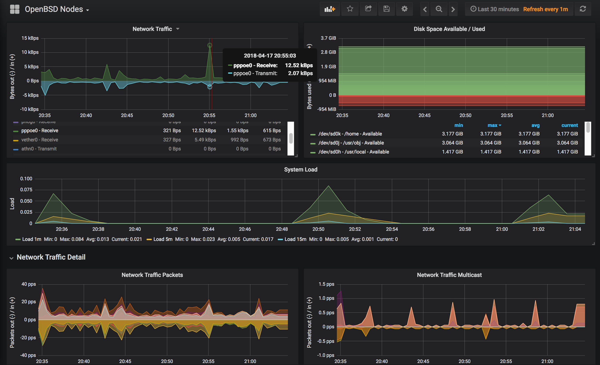
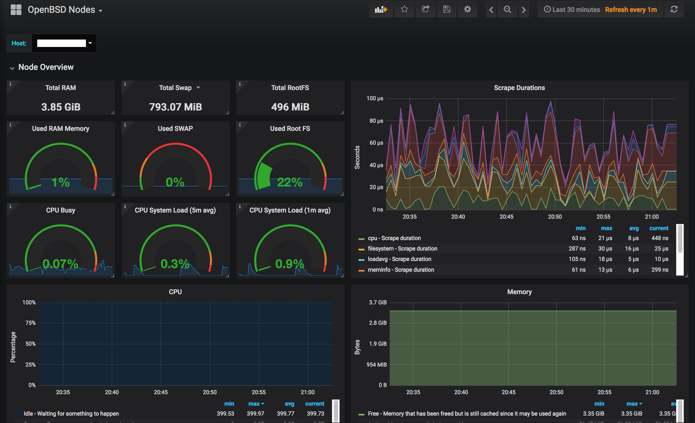

# homebrew-openbsd-pcengines-router

## About

This repo contains revised notes and Ansible collateral from building this fully open source router, circa early Feb 2017.

08/18 update: an official [WireGuard](https://www.wireguard.com/xplatform) userspace implementation is available and working on OpenBSD 6.3. The router now features this [revolutionary](#wireguard) VPN on tun0.

07/18 update: friends don't let friends have [Bufferbloat](https://en.wikipedia.org/wiki/Bufferbloat). [FQ-CoDel](https://en.wikipedia.org/wiki/CoDel) was merged into 6.2 so take [advantage](#bufferbloat) of it.

03/18 update: moved from OpenBSD 6.0-CURRENT to 6.3-STABLE. The router had a solid 400 day uptime.



#### What

The router is built almost entirely of [PCEngines](http://www.pcengines.ch) components, running [coreboot](https://www.coreboot.org/) and [OpenBSD](https://www.openbsd.org), with all modifications to the base install immutable by way of [Ansible](https://www.ansible.com).

#### Why

A couple of reasons really. Firstly, it undoubtedly would have been more orthodox to put the FreeBSD-based pfSense on this kit and be done with it. However, while I've continued to follow OpenBSD's bi-annual releases with interest, it has been a good few years since I put it on a device for a reason. Plus, with the recent flurry of IoT/consumer router vulns, I get the feeling I'm going to want my home internet appliance protected by OpenBSD in the future.

There was definitely a little nod to nostalgia as well. The project was reminiscent of building a homebrew router as a teenager for sharing out the family ISDN connection. Cobbling together an old Pentium box/NICs/Modem, unable to decide between the BSDs, Slackware, Gentoo, messing around with interface settings, `pf`, `ipchains`, `pppd` and so on. Busting out the null modem cable and `screen` also brought back fond memories from time spent interning in Sun Microsystem's labs. _Slapping OpenWRT or DD-WRT on a consumer router just wouldn't have given the same satisfaction_.

Finally, pragmatically speaking, I wanted a little more muscle in my internet appliance for use cases like: OpenVPN, IRC bouncing, TOR, hosted git, torrenting daemon hooked up to my NAS etc., as opposed to delegating those use cases downstream to yet another device. The apu2c4 is the right mixture of power and efficiency (I read it draws ~6w but haven't checked).

## Purchases

| Quantity | Part # | Description | USD | Origin
|----------|--------|-------------|-------|-------
| 1 | apu2c4 | APU.2C4 system board 4GB | $106.00 | TW
| 1 | case1d2blku | Enclosure 3 LAN, black, USB | $9.40 | CN
| 1 | ac12vuk | AC adapter 12V 2A UK for IT equipment | $4.30 | CN
| 1 | msata16e | SSD M-Sata 16GB MLC Phison | $14.50 | TW
| 1 | wle200nx | Compex WLE200NX miniPCI express card | $17.50 | CN
| 2 | pigsma | Cable I-PEX -> reverse SMA | $2.90 | TW
| 2 | antsmadb | Antenna reverse SMA dual band | $4.00 | CN
| 1 | usbcom1a | Adapter USB to DB9F with cable | $7.50 | CN

Total (incl. shipping to Australia): **$183.20 USD**

#### Additionally, you will need...
- Small USB flash
- Ethernet cables
- OpenBSD
- Screwdriver
- Pliers
- Patience

## Assembly



> NOTE: Prior to assembly it would be wise to read the APU2 series [board reference](http://www.pcengines.ch/pdf/apu2.pdf).

1. Install heat spreader and make sure it's pressed against the enclosure.
2. Attach bottom of enclosure, screw back in DB2 bolts and enclosure bolts.

    > NOTE: Don't forget to remove the DB9 bolts when slotting in the enclosure.

3. Attach the SSD (be sure to identify the mSATA from the mPCI slots) and any other mPCIs/SD cards.
4. Attach the wireless radio card.

    > NOTE: Wireless radio cards are ESD sensitive, especially the RF switch and the power amplifier. To avoid damage by electrostatic discharge, the following installation procedure is recommended from PCEngines:
    >
    > 1. Touch your hands and the bag containing the radio card to a ground point on the router board (for example one of the mounting holes). This will equalize the potential of radio card and router board.
    > 2. Install the radio card in the miniPCI express socket.
    > 3. Install the pigtail cable in the cut-out of the enclosure. This will ground the pigtail to the enclosure.
    > 4. Touch the I-PEX connector of the pigtail to the mounting hole (discharge), then plug onto the radio card (this is where the pre-requisite patience comes in. I found this very finicky and spent perhaps 15 mins just getting those bastards in!)

5. Attach the antennae, making sure the washer bolt is tight.
6. Finish screwing the enclosure and plug in the DB9 cable.
8. Plug the DC cable in first before power outlet to avoid arcing.

## Running

#### Serial Console

I was using a Macbook/macOS for this project.

Serial Settings: 115200 baud rate, 8N1 (8 data bits, no parity, 1 stop bit). See [here](http://pcengines.ch/howto.htm#serialconsole).

The [PCEngines usbcom1a](http://www.pcengines.ch/usbcom1a.htm) uses the Silicon Labs CP2104 controller for which you can grab the driver [here](https://www.silabs.com/products/mcu/pages/usbtouartbridgevcpdrivers.aspx) (Mac/Linux/Windows)

> 2018 update: to get this driver working on Sierra I had to install the legacy version of v5 *twice*. The double install gets the devices created and kernel driver loaded. No response from SiLabs on a fix at the time of writing this.

```bash
# Use a terminal multiplexer like `screen`
screen /dev/tty.SLAB_USBtoUART 115200
# Remember you're in screen, usual rules apply. Quit or Detach (below):
<C-a D D>
```


> NOTE: pay attention to the BIOS version here, later you will decide whether it needs updated or not.

## Memtest

First and foremost, you should probably run a Memtest.

1. Power cycle the router.
2. Quickly fire in an F10 (remember fn key if Macbook) before the boot sequence gets too far.

    > NOTE: This is a good time to make sure your SATA/PCI slots are seated and registered. They show up in the F10 menu.

3. Select: Payload [memtest]



4. ~2 hours later I had completed one pass which was good enough for me.

    > NOTE: The apu2c4's AMD GX-412TC has a max temp rating of 90C. Mine hit a max of 69C during this test in a 30C ambient temperature (Australian summer)

## BIOS Update

If the BIOS version you have (as noted above) is earlier than that which is available on [PCEngines](http://pcengines.ch/howto.htm#bios), continue with this section.

> NOTE: In hindsight I realised I could have flashed the ROM from within OpenBSD using [`flashrom`](http://ports.su/sysutils/flashrom). You may alernatively wish to just go ahead with the BSD install and update your BIOS afterwards. Regardless, what follows are the notes I took, some of which will be relevant anyway.

#### Prepare

This step involves creating a bootable USB containing [PCEngine's TinyCoreLinux](http://pcengines.ch/howto.htm#TinyCoreLinux) and the latest [APU2 ROM](http://pcengines.ch/howto.htm#bios). At the time of writing this, the following versions and instructions applied to macOS:

| File | Link | Digest
 ----- | ---- | ------
| PCEngines TinyCore Linux | http://pcengines.ch/file/apu2-tinycore6.4.img.gz | 48b8e0f21792648889aa99bf8156fed7
| PCEngines apu2 ROM | http://www.pcengines.ch/file/apu2_160311.zip | 780a8ffaa034e013fef7126f3f986646

1. Grab and verify the distributions:

    ```bash
    # Download
    curl -O http://pcengines.ch/file/apu2-tinycore6.4.img.gz
    curl -O http://www.pcengines.ch/file/apu2_160311.zip

    # Uncompress
    gunzip apu2-tinycore6.4.img.gz
    unzip apu2_160311.zip

    # Verify
    md5 apu2-tinycore6.4.img # 48b8e0f21792648889aa99bf8156fed7
    md5 apu2_160311.rom # 780a8ffaa034e013fef7126f3f986646
    ```

2. Add the ROM to the disk image. The easiest way I could find was simply to mount the IMG and drag the ROM into it, both using Finder.
3. Unmount both the IMG file and the USB
4. Write the IMG to the *raw* USB device. In my case this was `disk2`. Double check with `diskutil list`.
    ```bash
    sudo dd if=apu2-tinycore6.4.img of=/dev/rdisk2 bs=1m
    ```

#### Flash the BIOS
1. With the USB in a slot, power cycle the router.
2. Either fire in an F10 again, or wait and the boot order should kick in and launch TinyCore Linux from the USB.
3. This should land you in a rootshell with `/media/SYSLINUX` the mounted USB. Proceed to flash the ROM:
    ```bash
    flashrom -p internal -w /media/SYSLINUX/apu2_160311.rom
    ```
4. Reboot after you see the final `Verifying flash... VERIFIED`.

## OpenBSD

If one of your hopes for this kit is for it to function as a wireless access point, and you've bought the `wlen200nx` above (Atheros AR9280 chipset), or any Atheros based radio card, then you should look into the current status of 11n hostap support for [`athn(4)`](http://man.openbsd.org/athn).

At this time 6.0 is the latest `OpenBSD-STABLE` and [`athn(4)`](http://man.openbsd.org/athn) supports only `a/b/g` modes for hostap. I tested `b/g` on `-STABLE`, unscientifically at first through web browsing and `speedtest-cli`, then a little more scientifically with a few runs through `iperf`.

> NOTE: you'll need the [dual-band antenna](https://www.pcengines.ch/antsmadb.htm) if testing `a`.

The results were consistently disappointing - unusable bulk data transfer rates regardless of mode and channel. YMMV here, but others seem have had similar results according to the OpenBSD mailing lists. It seems the WiFi stack is still basic in this particular area, and I read there's simply not enough devs working on it.

However! `11n` support is being [actively worked on](https://marc.info/?l=openbsd-tech&m=148396652007923&w=2) in 6.0 `-CURRENT`. I am running this version and seeing significant improvements in data transfer speeds. Unfortunately still not as fast as my old Linksys/DD-WRT based access point. Though I still need to spend more time looking at optimising the OpenBSD network stack and selecting the perfect channel for my apartment, plus I can always fall back on using the Linksys unit as a bridged access point if all else fails.

Anyway, choose `-STABLE` or `-CURRENT` (or perhaps 6.1+) based on your WiFi access point needs and continue.

#### Install
1. You will want to grab the latest OpenBSD filesystem image and verify its SHA256 hash:
    > NOTE: Use a [mirror](https://www.openbsd.org/ftp.html) local to you.

    ```bash
    # STABLE
    curl -O http://ftp.openbsd.org/pub/OpenBSD/6.0/amd64/install60.fs
    shasum -a 256 install60.fs # Matches the install60.fs line item @ https://ftp.openbsd.org/pub/OpenBSD/6.0/amd64/SHA256

    # CURRENT
    curl -O https://ftp.openbsd.org/pub/OpenBSD/snapshots/amd64/install60.fs
    shasum -a 256 install60.fs # Matches the install60.fs line item @ https://ftp.openbsd.org/pub/OpenBSD/snapshots/amd64/SHA256
    ```

2. Stick the flash drive back into the Macbook, unmount it and write the OpenBSD filesystem to the drive:
    ```bash
    # Assuming `disk2` as before (again, confirm with `diskutil list`)
    diskutil unmountDisk /dev/disk2

    # Write install60.fs to the flash drive
    sudo dd if=install60.fs of=/dev/rdisk2 bs=1m

    # macOS mounted it again for me after this, so...
    diskutil unmountDisk /dev/disk2
    ```
3. Plug the flash drive into the router and turn it on. Assuming the boot sequence is the same as mine this will land you at the `boot>` prompt. If not, launch the USB from the BIOS menu or edit the BIOS settings and change the order so that USB slots are first up.
4. Pay attention to the serial console [FAQ](https://www.openbsd.org/faq/faq7.html). I found I had to tell the boot process to use the serial port as a console and change the baud rate. Though I found I didn't have to persist this in [boot.conf(5)](http://man.openbsd.org/amd64/boot.conf) as the FAQ said; it seemed to get done for me.
    ```bash
    boot> set tty com0
    boot> stty com0 115200
    ```

5. Go ahead with an OpenBSD install.
    ```bash
    Welcome to the OpenBSD/amd64 6.0 installation program.
    (I)nstall, (U)pgrade, (A)utoinstall or (S)hell?
    ```

    > NOTE: I won't detail install steps here; the [documentation](https://www.openbsd.org/faq/faq4.html#Install) has a sterling reputation for a reason.
    >
    > That said, you'll not have much need for the X11 and game install sets so you may as well de-select those.

## Immutability

It would be poor form to not [practice what I preach](https://martinfowler.com/bliki/ImmutableServer.html) in my day job and so I've taken to driving all modifications to the userspace using automation. The "immutability" aspect could be further improved with something like [Packer](https://www.packer.io) building out the OpenBSD filesystem image but that seemed like overkill. I just wanted to be able to blow away the OS and bring it back to where it was. I took the easy way out with (some pretty unidiomatic) Ansible and may revisit with something like NixOps which has been on my learn-list for ages.

## Ansible

Nothing special or highly refined in terms of Ansible here.

The `settings.yml` contains all variables used in the jinja2 templates and `./go.sh <ip>` orchestrates a few Ansible runs against the new OpenBSD install. 

Firstly to bootstrap Python for Ansible (using password auth via paramiko):
```bash
ansible -m raw -c paramiko -u "${USER}" -k \
    -b --become-method=su --ask-su-pass -a \
    "PKG_PATH=https://ftp.openbsd.org/pub/OpenBSD/snapshots/packages/amd64 \
    pkg_add python-${PYTHON_VERSION}" -i "$1," "$1"
```

Then a 1st provisioning pass enables [`doas(1)`](http://man.openbsd.org/cgi-bin/man.cgi/OpenBSD-current/man1/doas.1) and disables password auth in lieu of successfully configuring public keys:
```bash
ansible-playbook bootstrap.yml -kKi "$1,"
```

The main event provisions the rest of the configuration using key based logins and [`doas(1)`](http://man.openbsd.org/cgi-bin/man.cgi/OpenBSD-current/man1/doas.1) for superuser access:
```bash
ansible-playbook provision.yml -i "$1,"
```

## Noteworthy Configurations

#### Mail
OpenSMTPD is configured to externally relay using Google's SMTP servers. To do the same, you will need to enable ["less secure apps"](https://www.google.com/settings/security/lesssecureapps) on the Gmail account. Obviously use a burner account exclusively for this purpose rather than your personal Google account.

With SMTP relay set up, the last steps involving mail are to configure a mail alias for `root` to be the personal account in `settings.yml`.

#### Sensors
[sensorsd(8)](http://man.openbsd.org/OpenBSD-current/man8/sensorsd.8) is enabled to monitor the CPU temperature. I chose the arbitrary value of 70C. If the CPU temp exceeds this value then a mail will be sent to root (and thus my private email account as above).

#### Disk
[fstab(5)](http://man.openbsd.org/fstab) is updated to mount the root filesystem with no access time logging and soft updates for performance reasons.

#### DNS
Unbound DNS is enabled and configured to be a recursive caching DNS with upstream nameservers taken from `settings.yml`.

Fixed LAN clients declared in `settings.yml` are added as local-data resolutions, including the server hostname itself. The are also set up for reverse DNS.

Finally a list of [adservers](https://pgl.yoyo.org/adservers/serverlist.php?hostformat=unbound&showintro=0&startdate%5Bday%5D=&startdate%5Bmonth%5D=&startdate%5Byear%5D=&mimetype=plaintext) is loaded, with each configured to resolve localhost i.e. blocked. The adservers db is updated monthly from upstream using cron.

> TODO: look into configuring Unbound up with [dnscrypt](https://dnscrypt.org) ([dnscrypt-proxy](http://ports.su/net/dnscrypt-proxy,-main) from ports).

#### Network Time
NTP is enabled and pointed at a pool as per `settings.yml` and [`dhcpd(8)`](http://man.openbsd.org/dhcpd.8) is configured to advertise this to clients.

#### Networking
The `apu2c4` board has 3 NICs. The first of which, the `em0` interface, is used in conjunction with a `pppoe0` interface to make a connection to my ISP. Username/password configured in `settings.yml`.

The remaining NIC interfaces (`em1` and `em2`) are plumbed along with `athn0`, the wireless card, into a link aggregate interface which binds on the configured ip/netmask/broadcast in `settings.yml` (as the `vether0` interface). This completes the egress and LAN networking.

#### Firewalling
The [pf.conf(5)](http://man.openbsd.org/pf.conf.5) jinja2 template is individually annotated with comments. Below are a few highlights:

- A table of bogus private addresses ([bogons](https://en.wikipedia.org/wiki/Bogon_filtering)) is used in rules on the egress interface (in `pf` speak, this is the current default route). Anything coming in on `egress` destined for, or out on `egress` destined to one of these addresses will be dropped `quick`.
- This table is updated weekly using a cron, and reloaded into pf via [`pfctl(8)`](http://man.openbsd.org/pfctl.8). The bogon list is grabbed from [Team Cymru's reference](https://www.team-cymru.org/bogon-reference.html).
- Scrubbing/normalization is performed on all incoming packets and MSS clamping (1452, matching a respective kernel param in `sysctl.conf`) is performed on `egress`.
- Interactive SSH sessions, ICMP, DNS queries and packets with low-delay ToS are given priority.
- SSH connections are allowed in to the external port declared in the `settings.yml` (Ansible also updates `sshd_config` based on this port).

> NOTE: Setting the external port to :443 and using something like [`corkscrew`](http://agroman.net/corkscrew) would allow for tunneling out of a corporate network via the https proxy, if one were so inclined.

- A state table is maintained for suspected SSH brute force attempts. Any client matching a brute force pattern will be added to this table and subsequently dropped.
- [`syslogd(8)`](http://man.openbsd.org/syslogd) is used to translate firewall logs into ASCII format, and a cron and [`pf_log_rotate.sh`](./files/pf_log_rotate.sh) is used for rotation.

#### Bufferbloat
Also found in the [pf.conf(5)](http://man.openbsd.org/pf.conf.5) is a fix for [Bufferbloat](https://www.bufferbloat.net/projects/bloat/wiki/Introduction/). The `uplink_` variables should be set to about [90-95%](https://www.reddit.com/r/openbsd/comments/75ps6h/fqcodel_and_pf/doca4uv) of your uplink up/down in megabytes.

Use DSLreports.com's SpeedTest for Bufferbloat analysis:



#### WireGuard
The [WireGuard](https://www.wireguard.com)-go implementation is installed and configured via the provisioning process. It's possible to change things like port, CIDR blocks, peers etc. through `settings.yml`.

I'm mostly remotely accessing my home network with macOS. I'd recommend making use of [pass](https://www.passwordstore.org/) by the same author as WireGuard for encrypting private keys. This is achieved simply by replacing the `PrivateKey` line under `[Interface]` in the WireGuard config with:

```bash
PostUp = wg set %i private-key <(su user -c "export PASSWORD_STORE_DIR=/path/to/pass/store/; pass WireGuard/private-keys/%i")
```

In terms of workflow on macOS, [here's](https://techcrunch.com/2018/07/28/how-i-made-my-own-wireguard-vpn-server/) how you'd use AppleScript and the WireGuard CLI tools.

#### Monitoring
Prometheus' `node_exporter` is installed and configured as a system daemon as part of the Ansible provision run.

I have Prometheus itself running, along with Alertmanager and Grafana, on another server within my network. This is the [dashboard](./OpenBSDNodes.json) I'm using. It looks something like this:






#### TODO
- Port knocking for services like Transmission
- IPv6
- Set certain partitions as read-only
